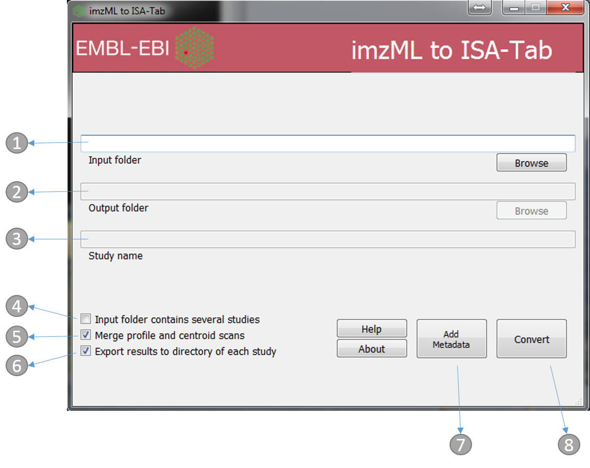

Usage
=====

Video tutorial
----------------

See below for 5 min video for how to use either mzml2isa-qt, imzml2isa-qt or nmrml2isa-qt.

https://www.youtube.com/watch?v=xy3uusQRkbI

Folder structure
----------------

For imzML files, you must have your imzML files in the same folder, but also
the low- and high-res images of your scans (*.jpg, *.ibd, *.ndpi, etc...)
named exactly like the imzML file of that particular scan (as mzml2isa scans
the directory of the source file to eventually extract the location of
those images)::

   /
   └ home/
     └ metabolomics/
       └ imzml_study_1/
         ├ A14 5cm S3.ndpi
         ├ A14 5cm S3.jpg               # Sample name will be
         ├ A14 5cm S3-centroid.ibd      # "A14 5cm S3"
         ├ A14 5cm S3-centroid.imzML    # and centroid and profile
         ├ A14 5cm S3-profile.ibd       # scans will be merged.
         ├ A14 5cm S3-profile.imzML
         ├ A14 10cm S3.ndpi
         ├ A14 10cm S3.jpg              # Sample name will be
         ├ A14 10cm S3-centroid.ibd     # "A14 10cm S3"
         ├ A14 10cm S3-centroid.imzML   # and centroid and profile
         ├ A14 10cm S3-profile.ibd      # scans will be merged
         ├ A14 10cm S3-profile.imzML
         └ ...
       └ imzml_study_2/
         ├ B14 5cm S3.ndpi
         ├ B14 5cm S3.jpg               
         ├ B14 5cm S3-centroid.ibd     
         ├ B14 5cm S3-centroid.imzML    

See the `mzml2isa <http://2isa.readthedocs.io/en/latest/mzml2isa/usage.html>`__  documentation for more details. 

Starting interface 
----------------

1.  Directory containing the mzML files. e.g. 'imzml_study_1' in the above example
2.  Output folder (automatically the same as input)
3.  Study name (automatically the same as the input folder name, e.g. 'imzml_study_1' in the above example)
4.  If the 'input folder' contains multiple studies then mzML2ISA will be run each study, e.g. in the above example if 'metabolomics' folder was chosen as the 'input folder' then the parsing will be performed on both studies ('imzml_study_1', 'imzml_study_2')
5.  If selected, when profile and centroided files of the same run are available the two files will be merged and saved under a single row in the assay file
6.  If selected, the output folder will be the same as the input folder and input folder name will be used as the study name
7.  The 'Add Metadata' button will open a new dialog box where users can add more metadata
8.  Start the conversion process!

Adding additional metadata
----------------
Users can add additional metadata manually through the dialog box below. However, all this information can be added at the final stage with ISAcreator agent.

.. image:: imzml2isa_qt_2.png

Conversion
----------------
The following dialog boxes after the convert button is pressed. By default this is run in parallel (multiple cores). The following file types will be generated Investigation, Study and Assay

.. image:: ../mzml2isa-qt/mzml2isa_qt_3.png

Editing with ISAcreator
----------------
The ISA-Tab structure can be further populated with the `ISAcreator software  <http://isa-agents.org/software-suite/>`__.

See brief `tutorial <http://2isa.readthedocs.io/en/latest/other/isacreator.html>`__  for more details. 

