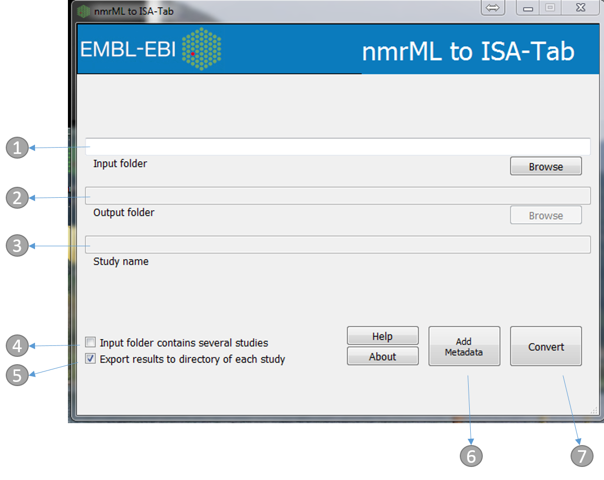
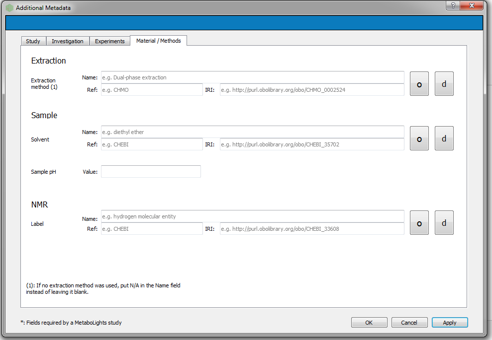

Usage
=====
Video tutorial
----------------

See below for 5 min video for how to use either mzml2isa-qt, imzml2isa-qt or nmrml2isa-qt.

https://www.youtube.com/watch?v=xy3uusQRkbI

Folder structure
----------------

nmrml2isa only requires that you put all you nmrML and zipped raw files
in the same folder, and parsing should work fine. Note that reference to
RAW files is extracted from the mzML files, so if you plan to create an
ISA archive after mzml2isa creates ISA files, don't forget to include
those as well.

Example structure::

   /
   └ home/
     └ metabolomics/
       └ nmrML_study1/     # the name of the folder doesn't matter
         ├ Sample1.nmrML  # the name of the file must correspond to the sample name
         ├ Sample2.zip    # the raw files should be zipped and called exactly like the nmrML
         ├ Sample2.nmrML
         ├ Sample2.zip
         └ ...
       └ nmrML_study2/    
         ├ Sample1.nmrML 
         ├ Sample2.zip    
         ├ Sample2.nmrML
         ├ Sample2.zip
         └ ...
       
         
         
         
Starting interface 
----------------

1.  Directory containing the mzML files. e.g. 'nmrML_study1' in the above example
2.  Output folder (automatically the same as input)
3.  Study name (automatically the same as the input folder name, e.g. 'nmrML_study1' in the above example)
4.  If the 'input folder' contains multiple studies then mzML2ISA will be run each study, e.g. in the above example if 'metabolomics' folder was chosen as the 'input folder' then the parsing will be performed on both studies ('nmrML_study 1', 'nmrML_study 2')
5.  If selected, separate assay files will be created for positive and negative assays
6.  If selected, the output folder will be the same as the input folder and input folder name will be used as the study name
7.  The 'Add Metadata' button will open a new dialog box where users can add more metadata
8.  Start the conversion process!

Adding additional metadata
----------------
Users can add additional metadata manually through the dialog box below. However, all this information can be added at the final stage with ISAcreator agent.

Conversion
----------------
The following dialog boxes after the convert button is pressed. By default this is run in parallel (multiple cores). The following file types will be generated Investigation, Study and Assay

.. image:: ../mzml2isa-qt/mzml2isa_qt_3.png

Editing with ISAcreator
----------------
The ISA-Tab structure can be further populated with the `ISAcreator software  <http://isa-agents.org/software-suite/>`__.

See brief `tutorial <http://2isa.readthedocs.io/en/latest/other/isacreator.html>`__  for more details. 

